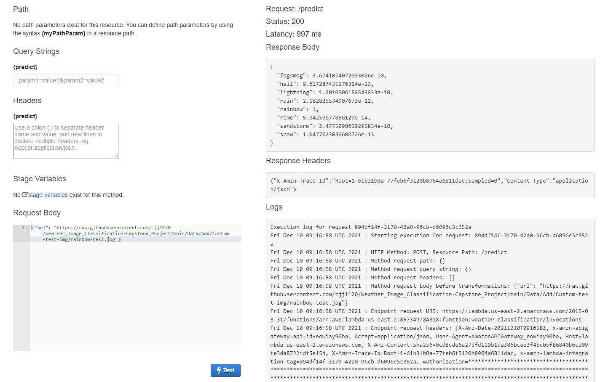

# Project Title: Weather classification 

## About the project 
This project aims to build a neural network to classify weather of 8 different classes. Transfer learning is used in this study. 

## Dataset 
https://www.kaggle.com/jehanbhathena/weather-dataset
There are total of 6862 images in this dataset. 
The dataset contain of 11 different calsses of weather:  dew, fog/smog, frost, glaze, hail, lightning , rain, rainbow, rime, sandstorm and snow. <br>
3 classes were dropped (`[dew, frost, glaze]`) as they are zoom-in shots of plants, the other are general weather shots (sky, city, open space view). I thought by removing these 3 classes, the dataset can be more consistent. <br>
8 Classes are included in this project: `[fog/smog, hail, lightning , rain, rainbow, rime, sandstorm, snow]`

## Model selection and explanation 
EfficientNet seems to give the best validation accuracy, we can see that Efficientnet perform well as compared to some of the other networks. Among all the Efficien Nets, EfficientNetB4 is choosen as it provides a good trade off of accuracy and speed. 

https://arxiv.org/pdf/1905.11946.pdf 
https://github.com/tensorflow/tpu/tree/master/models/official/efficientnet?utm_source=catalyzex.com

# Testing/ Running the project 

## To reproduce 
1. Download the dataset from [Kaggle](https://www.kaggle.com/jehanbhathena/weather-dataset), take note only 8 classes are included. The extra data was downloaded from free image website. You can access the added image here on [Google drive](https://drive.google.com/drive/folders/1A3yhT25B72at6X3Fi4HELH028gKCuCAb?usp=sharing), and put them into respective folders. 
2. The dependency file `requirements.txt` is a conda environment that I use for multiple projects that use tf-gpu and it contains many diffferent libraries. So beware when u install the dependencies, it's advisable to just use your tf environment.  
3. To trian the neural network, run the last section `D. Final model Checkpointing` or the python script `train.py`. Then you can convert the model to .tflite with `Tflite-model-conversion.ipynb`.        	 
4. For building docker image and testing it, refer to [section below](##To-test-the-model-locally-(without-Docker):). Test images are stored under this [repo](https://github.com/cjj1120/Weather_Image_Classification-Capstone_Project/tree/main/Data/Add/Custom-test-img) as well. 
5. Likewise, you can also test the deployed AWS Lambda function with the API access link in `test-AWS-API.py`, alternatively you can follow [section below](##Test-the-lambda-function-with-AWS-API:) to test the API. Below image shows testing of the API within AwS:  

## To test the model locally (without Docker): 
```
Open console, Ipython 
import lambda_func
url ='https://raw.githubusercontent.com/cjj1120/Weather_Image_Classification-Capstone_Project/main/Data/Add/Custom-test-img/rainbow-test.jpg'
lambda_func.predict_url(url)
```

## Test with Docker locally:
1. Build docker image `docker build -t weather-model .  
2. Run the image `docker run -it --rm -p 8080:8080 weather-model:latest`
3. Test with following command `python test.py` 

## Test the lambda function with AWS API: 
In console, run `python test-AWS-API.py`